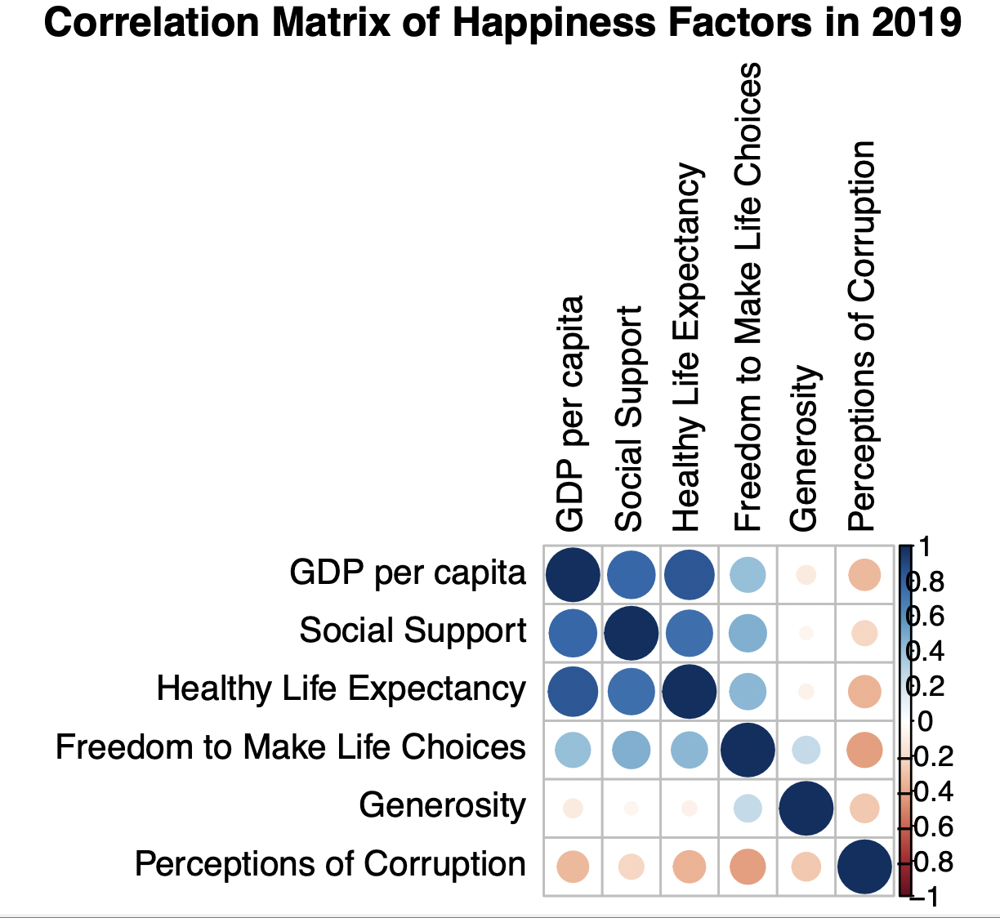
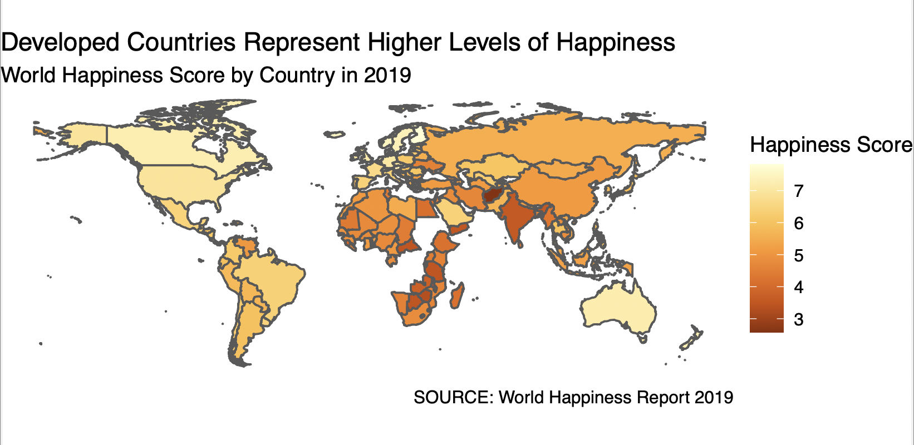
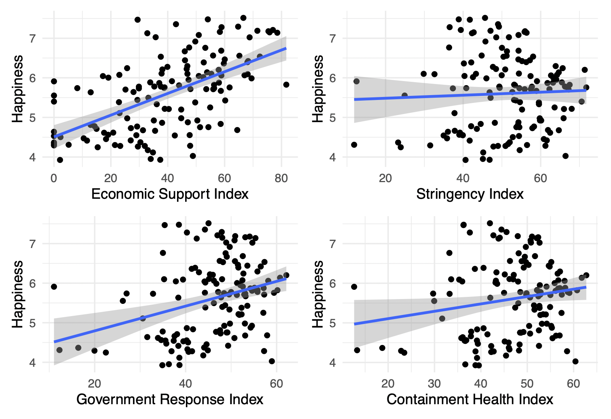
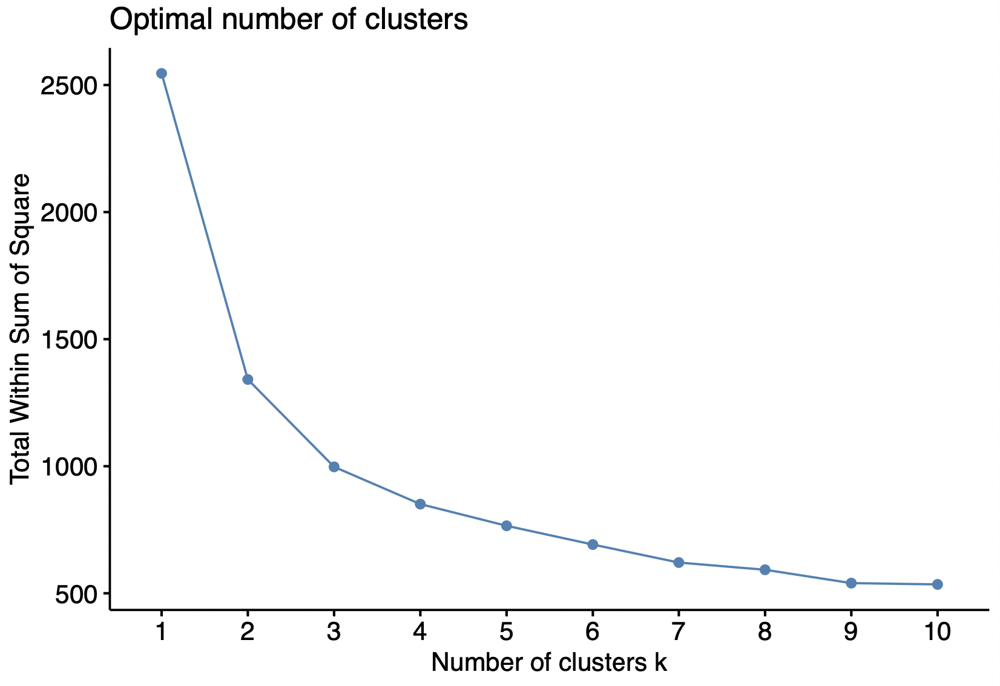
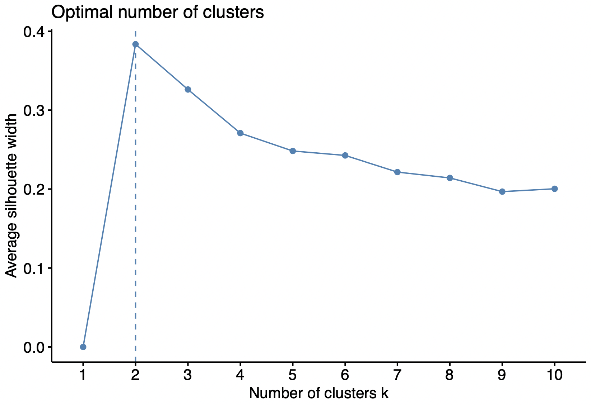
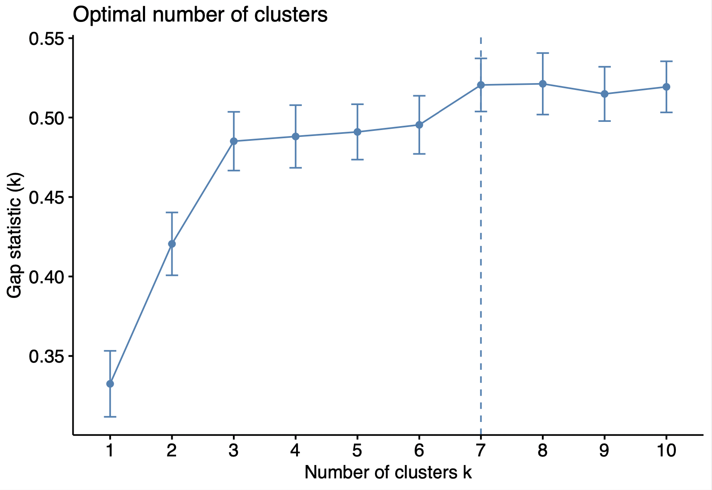
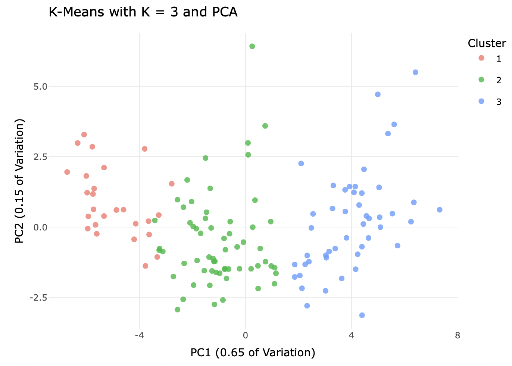
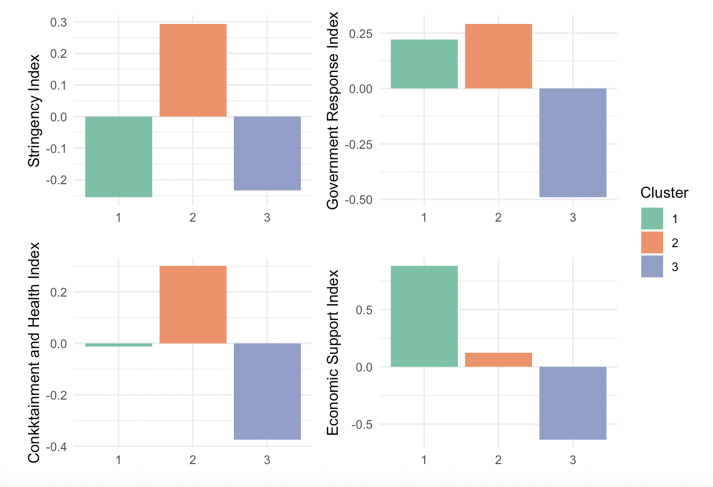

# Covid Response Policy among Countries with Different Happiness Levels

### Data

For this analysis, we combine two data sources. The first one is [World Happiness Report 2019 and 2020](https://worldhappiness.report/), a landmark survey of the state of global happiness that ranks worldwide countries by how happy their citizens perceive themselves to be. Among the variables, the happiness score is a national average of the responses to the main life evaluation question asked in the Gallup World Poll (GWP), which uses the Cantril Ladder. Happiness score can be explained by the other six factors, namely  GDP per capita, Healthy Life Expectancy, Social support, Freedom to make life choices, Generosity, and Corruption Perception, which are also included in the dataset.

The second source is the database of variation in government responses to COVID-19 from 2020 to now collected by the [Oxford COVID-19 Government Response Tracker (OXCGRT)](https://www.bsg.ox.ac.uk/research/research-projects/covid-19-government-response-tracker), providing a systematic cross-national, cross-temporal measure to understand how government responses have evolved over the full period of the disease's spread. It also offered the composition and calculation of several policy indices, among which we took advantage of 4 indices, namely government response index, containment and health index, stringency index and economic support index.

After deleting missing values and selecting variables of interest, we are left with 153 countries in World Happiness Report 2019, 136 countries in World Happiness Report 2020 and 187 countries in Oxford COVID-19 Government Response Tracker 2020.

**Full Github Repository:** [PPOL670 Intro to Data Science Final Project](https://github.com/VladimirCao/final_project)

The full analysis can also be [read alongside the code that produced the figures.](https://github.com/VladimirCao/final_project/final-project.html)

## Part I. Exploratory Data Analysis

The correlation matrix displays the correlation between six happiness factors, of which the color intensity is proportional to the coefficients. As shown above, except for generosity, all other five factors show strong correlation. There are strong positive correlation between GDP, social support, healthy life expectancy and freedom to make life choices and negative correlation between perceptions of corruption and other variables.

As we can see in the map, dark orange stands for lower level of happiness, and vice versa. We can see that in 2019, people in North America, Western Europe, Australia and New Zealand report higher happiness scores, corresponding to most developed countries in the world. In contrast, low-income countries like Southern Asia and Africa represent the lowest happiness scores worldwide, corresponding to a darker color.

## Part II. Machine Learning

We constructed Random Forest and LASSO model with data in 2019, and choose the model with smaller RMSE as the best model to predict the world happiness score in 2020. As the Random Forest Model returns a lower RMSE, we choose it as our best model to predict the happiness score in 2020. After Predicting the happiness score for each country in 2020, we conducted our analysis based on this new predicted dataset.

### A. Pre-analysis: OLS regression 

Before doing cluster analysis, we use OLS regression to see the relationship between covid response policy index and predicted happiness scores in 2020. According to the graphs, we can see that with the exception of stringency index, other three indices
are associated with happiness scores. Thus, we infer that after we cluster happiness factors, covid response policy index and weighted happiness scores, index of economic support, government response and containment health would show difference between each cluster.

### B. Cluster Analysis

After we scaling the data to ensure all variables are on the same unit, we put more weight on happiness so that the clustered groups are able to reflect different levels of happiness. The next step is to conduct a cluster analysis, finding which countries are in each group accordingly with a world map and an interactive cluster plot. The suggested number of clusters is 2 and 7. However, for the purpose of better interpretation and visualization, we choose k = 3 as the number of clusters.

After running PCA. The first principal component explains  0.65 of the variance. The second principal component explains 0.15 of the variance. To get a preliminary understanding the characteristics of each cluster, we find the names of most central countries in each cluster. In the first cluster, Germany is the most central country, corresponding to a happiness score of 4.44. In the second cluster, South Korea is the most central country, of which its happiness score is 0.45. In the third cluster, Senegal is the most central country and its happiness score is -3.27. So this provides us with evidence that the first to the third cluster group represent the highest to the least happiness scores accordingly.

Comparing the geographic distribution of each cluster group and happiness levels, we find significant similarities. The first group, mainly distributed in North America, Western Europe, Australia and New Zealand, corresponds to countries with the highest happiness levels whereas The third group, mainly in Africa and Southern Asia, represents the least happiness levels. The second group corresponds to countries with medium happiness level.

### C. Compare Mean Covid Response Policy Index by Cluster Group

As we can see from the graph below, cluster 1 and 3 have negative mean stringency index, imply that those countries are less likely to implement rigorous closure policy. While cluster 2 countries are prone to enforce stern closure policy. Stringency index’s difference between group is relatively indistinctive. 

This finding may be explained by two different reasons. The first explanation is that covid closure policy would not heavily affect people’s happiness. While given the fact that there are many researches in psychology have demonstrated that isolation from ordinary social life can produce significant negative impact on people’s mental health, this argument may be questionable. Another explanation is that closure policy would significantly affect people’s happiness, but its effects can be partly offset by economic support and health investment provided by governments. Considering the evidence in the fields of sociology and psychology, the second explanation may be more reasonable. 

As of the government response index, cluster 3 enjoys negative government response index, while cluster 1 and 2 countries' governments are more responsive compared with cluster 3 countries.

Government response index’s difference between groups is relatively insignificant. Considering that this index is the aggregation of other 3 indexes, the between group variation of economic support index and containment and health index may be partly offset by stringency index. The total effect of covid relevant policies appears to have moderate impact on people’s happiness index. 

Cluster 3 have negative containment and health index while cluster 1 countries' mean index is also nearly 0. Compared with cluster 2 countries, they are less prone to provide additional health investment. Cluster 3 countries' economic support on citizens are relatively weak, while countries for cluster 1 and 2 more prone to provide economic support for citizens, especially for countries in cluster 1.

These facts indicate that economic support index and containment and health index have larger difference between group based on happiness index compared with stringency index and government response index. This phenomenon may be explained by the relationship between countries’ economic condition and citizens’ happiness. Developed countries usually enjoy higher happiness index, and also have the ability to provide greater economic support and health investment. As countries are divided mainly based on happiness score, it is reasonable to discover that these two indexes are significantly vary between groups. 

